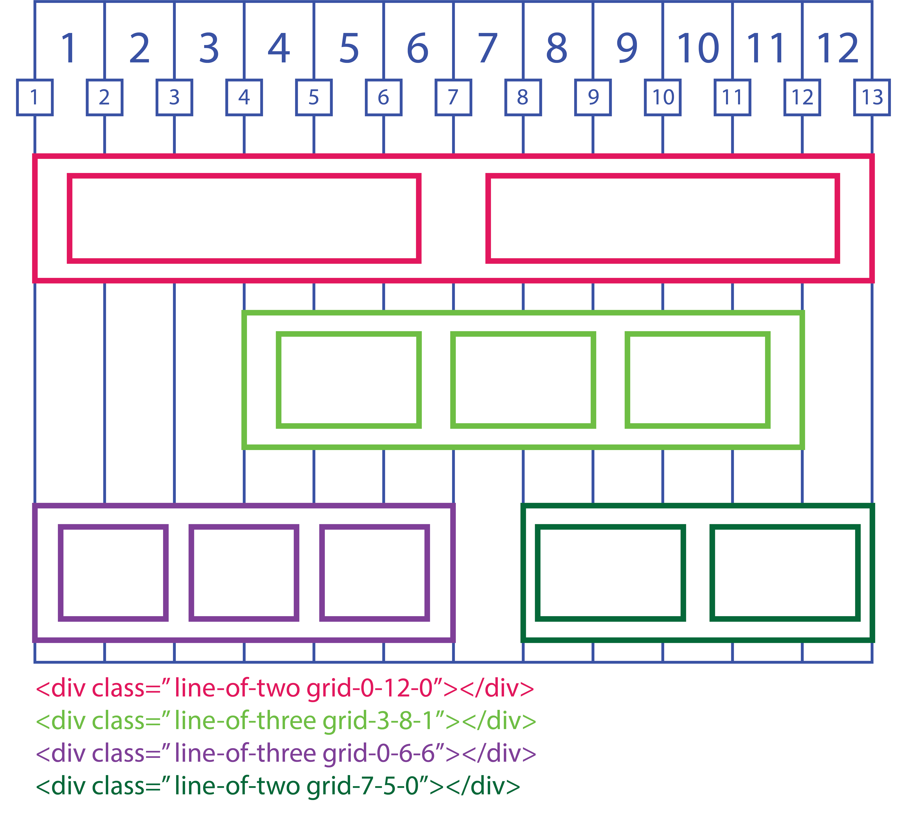

# CSS grid framework

This is the 8th project of the HTML & CSS of microverse based on The Odin Project

>This Project consists of building a grid-based framework (similar to bootstrap) that includes some basic functionality necessary to build a website, we choose www.mercadolibre.com.uy

You can find the original project specification at:

* https://www.theodinproject.com/courses/html5-and-css3/lessons/design-your-own-grid-based-framework

---
 👉 [meli demo](https://cdn.statically.io/gh/sebastianlujan/grid-based-framework/features/index.html)

 For this framework we created several partials in SCSS in order to create easy to understand modules divided in two directories, one for configuring absolute and relative values and one for structure set of up of the different pre made containers.

 Such containers were designed in order to have two break points and a specific behavior for mobile, tablet and desktop screens.

 Additionally since our framework is based on a twelve columns grid, there is a module specially created for positioning elements along those columns, that consider the number of columns to the left, the width in columns of the element and, finally, the number of columns to the right. it is expressed as 3-6-3.

 In a similar manner to bootstrap, cards were created, although there is only single and double cards, evidently, double cards are twice as wide as the single cards.

 Most of the other set up modules such as colors and spacing are pretty self-explanatory, and rather simple to use.

 For the purpose of clarity, here we can find an example:

 Where:
 - Cyan: Two rows of the pre-configured Nav Container
 - Orange: A pre-made container called line-of-five, containing five single cards.
 - Purple: A pre-made container called line-of-two, containing two double cards.
 - Pink: A pre-made container called feature-grid, that allows some flexibility for      grids with differently sized elements.
 - Yellow: A pre-configured menu to have a special hover behavior.

 All of these are used through mixins, so the user is completely free to use any naming system for classes, just needing to invoke the adequate mixin within the SCSS selector.

 As a final note, SCSS is required to use this framework, since there is NOT a compiled version in plain CSS.

 # Positioning

 For our breakpoints que used 0 to 720px, 721 to 1024px and 1025px onwards, which kind be modified in the SCSS File called _containers within the mixins directory which will define the behavior of each container when collapsing. 

 For default, containers will collapse to one column in less than 720px and two columns within 721px to 1024px.
 
 For positioning we use a combination of two classes the first will define the content of our container, and the second will define the width and horizontal position of the container in the general grid.

 For the containers we use:
 - line-of-two
 - line-of-three
 - line-of-four
 - line-of-five
 - line-of-six

 For the horizontal position and width we will used the previously explained x-y-z format where x+y+x must be always equal to 12.

 Here are a few examples:

 

 # Authors

- [Sebastían Luján] (https://github.com/sebastianlujan)
- [Fernando Del Valle] (https://github.com/ferdelvalle)